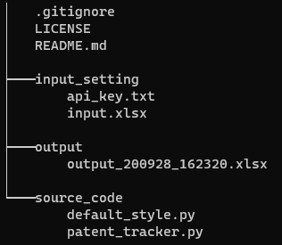
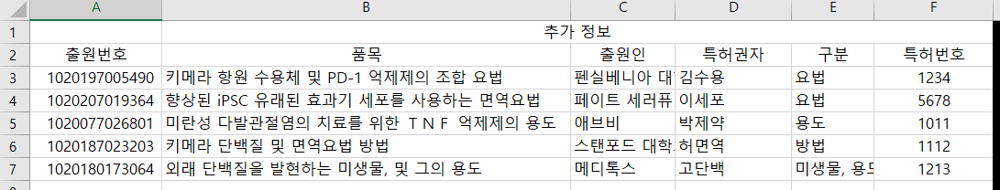
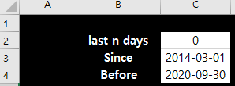
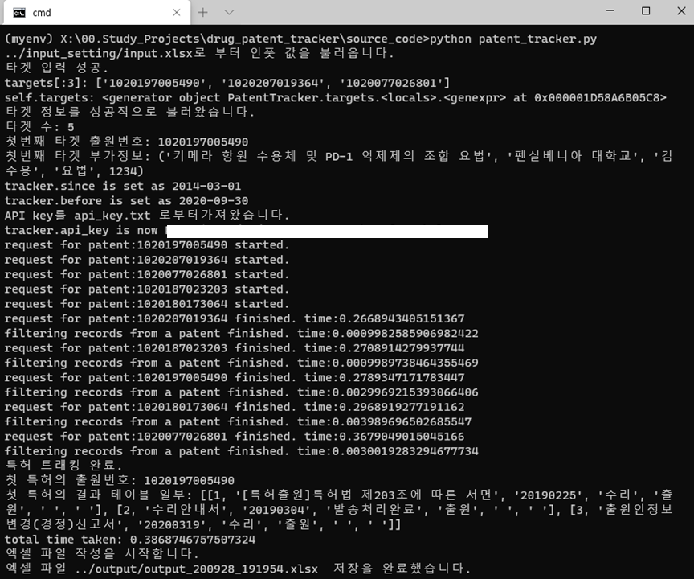
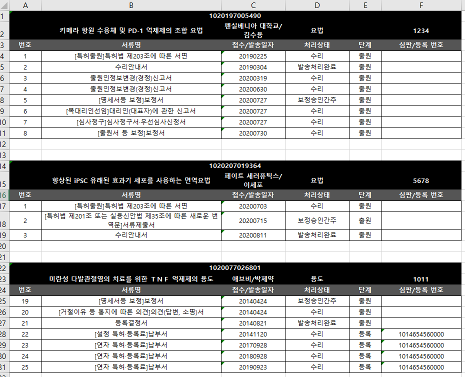

# Patent_Tracker

> Sorry! I wrote this `Readme.md` in Korean because this program is created for native Koreans.
>
> Simply put, it asynchronously requests patent information using OpenAPI provided by Korean Intellectual Property Office (KIPO) and summarize events.


KiprisPlus에서 제공하는 API를 이용해 원하는 특허를 추적하여 변동사항을 정리할 수 있습니다.

특허관련 업무를 담당하는 분 들 (e.g. 변리사)이 사용하실 수 있습니다.

범용 patent tracker 및 drug_patent_tracker(아웃풋 양식만 조금 다름)를 지원합니다.


지인의 요청으로 예전에 만들었던 크롤러를 포트폴리오 용으로 간단히 리팩터링 하였습니다.

반영한 주요 사항은 아래와 같습니다.

1. 당시 selenium으로 크롤링(kipris) 하던 것을 REST API (kipris plus)를 이용하도록 변경.

2. 비동기 처리(aiohttp)를 사용. (학습 목적)

3. 객체지향 프로그래밍 사용. (학습 목적)


사용한 Open API 관련 정보는 https://www.data.go.kr/data/15056882/openapi.do 에서 확인하실 수 있습니다.


## Notice

<strong> ####### 반드시 api_key 를 등록해야만 사용이 가능합니다 (Setting 참고) ####### </strong>


## Setting

아래와 같은 파일 시스템 구조를 가지고 있어야 합니다. 

폴더명 및 파일명을 참고하여 파일을 불러오므로 폴더명 및 파일명을 바꿀 경우 정상적으로 작동하지 않을 수 있습니다.




이 프로그램은 API요청을 통해 값을 받아오므로 api_key가 필요합니다. 

http://plus.kipris.or.kr/ 로 접속하여 회원가입 후 api 사용 요청 후 api_key를 받으셔야 사용이 가능합니다. 

api_key하나로 월 1000건의 무료 API 요청이 가능합니다.

api_key를 획득하신 후  api_key.txt 의 맨 윗줄에 api_key를 붙여넣어 주세요.


input_setting 폴더의 input.xlsx파일을 열어 targets 시트에 타게팅할 특허 관련 정보를 넣어주세요.

출원번호만 있으면 검색이 가능하며, 추가정보 란에는 결과물에 작성할 정보를 넣어주세요.




다음은 날짜 설정입니다.

dates 시트로 이동하여 검색하고자 하는 날짜 구간을 설정해 주세요.



last n days(C2 셀) 값을 양의 정수n으로 입력 하시면 최근 n일 간의 변동을 추적하게 됩니다.

last n days를 0으로 놓으면 Since(C3 셀)와 Before(C4 셀)에 있는 값을 읽어와 해당 기간내 특허 이력을 추적합니다.


마지막으로 아웃풋 관련 설정입니다.

output_mode에서 drug 또는 normal을 설정해 주세요.

결과물로 생성되는 excel파일이 input의 추가정보를 어떤 열에 어떻게 넣을지 결정됩니다.


## QuickStart


### I. exe 파일을 다운로드하여 실행

 아래 주소에서 exe 파일을 다운받은 후 실행하시면 됩니다.

  `시간이 될 때올리도록 하겠습니다. 일단 두번째 방법을 이용해 주세요.`


### II. 파이썬 설치하여 직접 소스코드 실행. 

1. 파이썬 (3.7 또는 이상)을 설치합니다.
2. cmd상에서 source_code 폴더로 이동 합니다.
3. `pip install requirements.txt`를 입력하여 라이브러리를 설치합니다.
4. `python patent_tracker.py` 명령을 실행합니다.


아래와 같이 실행되면 성공입니다.



output 폴더에 생성된 엑셀 파일을 열면 다음과 같은 결과물을 확인하실 수 있습니다.




## Properties (attributes)

```python
def __init__(self):
    self.__api_key: str = ""
    self.__targets: Iterator = (i for i in [])
    self.__since:date = date(1970,1,1)
    self.__before:date = datetime.now().date()
    self.__additional_info_dict: Dict = {}
    self.__results: List = []
```


## Methods

`tracker.api_key = "put_your_api_key"`

 * automatically loaded from **input_setting/api_key.txt** when instance is created

   

`tracker.read_input(input_path=input_path) `

 * automatically executed when instance is created.


 `tracker.fetch_targets([target1, target2 ...])`

 * automatically loaded from "targets" sheet in **input_setting/input.xlsx**


`tracker.set_dates("2020/09/01","2020/09/30") `

* automatically loaded from "dates" sheet in **input_setting/input.xlsx**


## Todo

- directory tree그려넣기.
- requirements.txt 넣기.
- #save_to 항목 도 만들기. (디폴트 현재폴더)
- selenium 이용 크롤링 지원?
- 사용법 (QuickStart for consumers, QuickStart for developers)
- 핵심기능 관련 도큐먼트 작성 (클래스 종류 및 arguments)
- invalid api key 처리, 당월 API 요청 가능 횟수 초과 처리